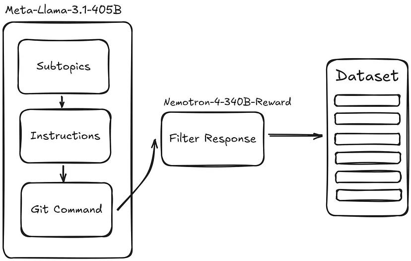

# Create Synthetic Dataset Using Llama 3.1 to Fine-Tune Your LLM

## Technologies used

- Llama 3.1 405B 
- Nvidia Nemotron 4 reward model

## Platforms used

- Nvidia NIM API

## Workflow



## References

- [Hesam Sheikh (07.08.2024) - Create Synthetic Dataset Using Llama 3.1 to Fine-Tune Your LLM](https://towardsdatascience.com/create-a-synthetic-dataset-using-llama-3-1-405b-for-instruction-fine-tuning-9afc22fb6eef).


## Useful commands
- save the requirements
```bash
pip freeze > requirements.txt
```